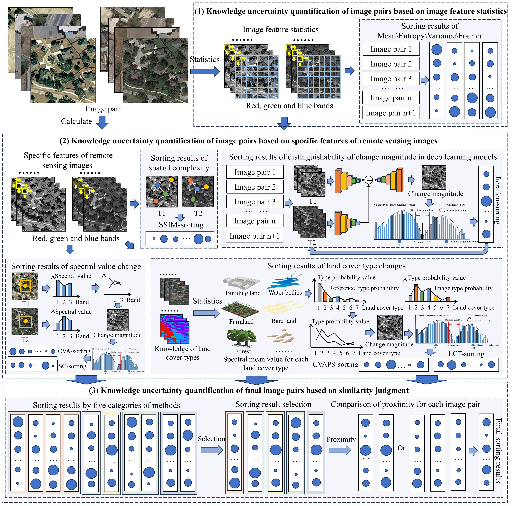

Figure 1 shows the framework of UKUQ change sample selection method, which can be divided into the following steps: (1) Knowledge uncertainty quantification of image pairs based on image feature statistics: the representativeness of image pairs is sorted by utilizing the image pairs' own information changes and the distinguishability of change magnitude in the deep learning model. (2) Knowledge uncertainty quantification of image pairs based on specific features of remote sensing images: the representativeness of image pairs is sorted using changes in spectral values, changes in land cover types, and spatial complexity.  (3) Knowledge uncertainty quantification of final image pairs based on similarity judgment: In each of the above five methods, one of the most effective sorting is selected, the sorting results are judged for similarity, and the closest sorting results are superimposed to get the final result.

Figure 1. Framework of the proposed UKUQ method
